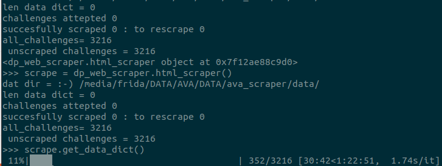

## DP Challenge Full Site Scraper

This Repository contains a tool for webscraping images from dp challenge and generating a data dictionary of images.

currently it is a work in progress.

##### Part 1:
>> generates a json file of image meta data and urls form competition pages
>> this takes about 4 hours to scrape 3k individual pages from a list of competion pages.
>> genreates and writes to a json file at each itteration 

>> should the scrape be interupted then will read from where it left off.

>> in addintion to using proxy rotation via scaperapi.com the the individual page list is randomly permuted at each scrape to further.

the above is a roadmap for obatinign images and further meta data such as comments from idividual image pages.
There is an example of a json file that has all images 

#### part 2:

scrapes images from individual urls. There are two types of url:

>> 1 thumbnail images
>> 2. full resolution images

both of these can be scraped.

oat present thy .py file is consistst of on large script consisitiong of a single class that needs to be innitialeted and then methods called.
the simplest way to run this is using Ipython and importing dp_challenge_web_scraper
>>> `pyenv activate 'enviroment created`
>>> `python` 
>>> `>>> import dp_web_scraper`
>>> `>>> dp_web_scraper.html_scraper()`

here is an exampler of an image scraped form dp [challenge.com](https://www.dpchallenge.com/)

a list of competition/challenges pages [avalable on dpchallenge](https://www.dpchallenge.com/challenge_history.php?order_by=0d&open=1&member=1&speed=1&invitational=1&show_all=1)

an example challange page where image urls are derived can be found [here](https://www.dpchallenge.com/challenge_results.php?CHALLENGE_ID=3257&show_full=1)

an example image page is [here](https://www.dpchallenge.com/image.php?IMAGE_ID=1263084) 

#### Instructions

You will need a [scripaerapi.com](https://scraperapi.com) account to create get api key- a free version will give you the required 
> `pip install requirements.txt` in new python 3.9.5 virtual environment
> `pip install jupyter_requirment.txt` in new python 3.9.5 venv if running ipython interactive shell

at present `dp_challenge_` 

