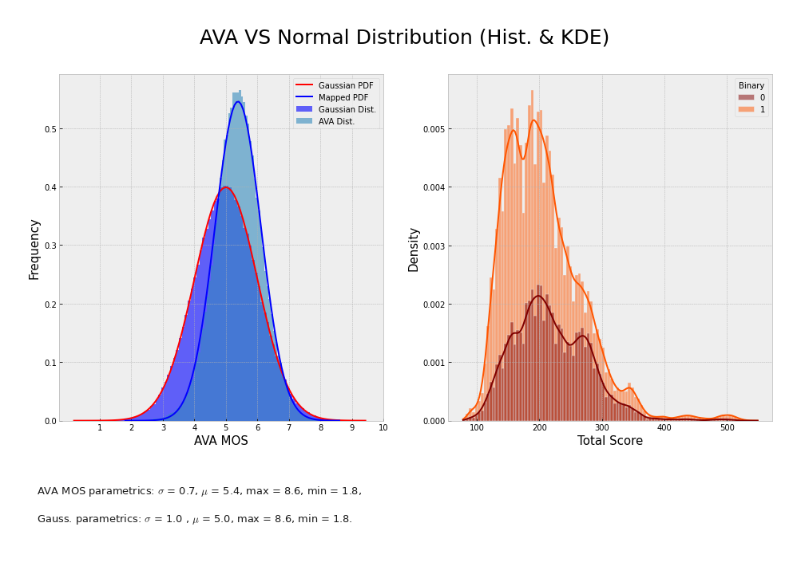
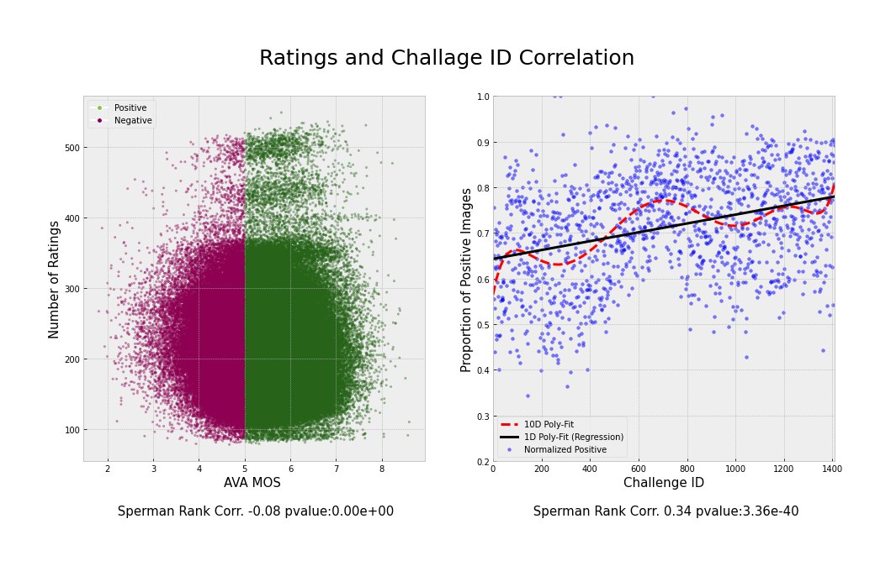

## DP Challenge Full Site Scraper 

www.dpchallenge.com images and crowdsourced meta data is the largest single source of image quality dataset available and is the source of the Aesthetic Visual Analysis (AVA) dataset. Since the AVA benchmarking dataset was initially scraped in 2012 there is a significant amount of new images and associated metadata. Additionally Camera metadata and full comments are missing.

The purpose of acquiring more data is here is fourfold:
- Addressing class imbalance(AVA has more positive than negatively rated images);
- Provide more data for models that require a higher number of images to train (Vision Transformers);
- To scrape natural language data for training multi modal transformers (Vision/NLP).
- Prediction of camera settings from camera data.

This web  scraper is working but currently under development

This Repository contains a tool for web scraping images from dp challenge and generating a data dictionary of images.


## Context:

Each image has an average of 210 ratings 1-10, these can be used to compute a probability distribution of each image and mean observed score (MOS). Whether training a binary classifier of regression this score is used as groud truth.

Below shows distribution of scores vs Gaussian probability density function (pdf):



Below shows relationship between competition (challenge ID) and MOS:




## Part 1:

#### Instructions
In a new python 3.10 virtual environment

```bash
pip install -r requriments.txt
python main.py --api_key 'your_scraper_api' --get_meta
```
>> - Generates a json file of image meta data and urls form competition pages.
>> - Takes about 4 hours to scrape 3k individual pages from a list of competition pages.
>> - Generates and writes to a json file at each iteration.
>> - Should the scrape be interrupted then will read from where it left off.

The above is a roadmap for obtaining images and further meta data such as comments from individual image pages.
There is an example of a json file that has all images


## part 2:

Scrapes images from individual urls. There are two types of image url:

-  1. Thumbnail images
-  2. Full resolution images

Example image scraped form dp [challenge.com](https://www.dpchallenge.com/)


### Example pages:

-  Example list of competition/challenges pages [available on dpchallenge](https://www.dpchallenge.com/challenge_history.php?order_by=0d&open=1&member=1&speed=1&invitational=1&show_all=1)

- Example challenge page where image urls are derived can be found [here](https://www.dpchallenge.com/challenge_results.php?CHALLENGE_ID=3257&show_full=1)

- Example image page is [here](https://www.dpchallenge.com/image.php?IMAGE_ID=1263084)


